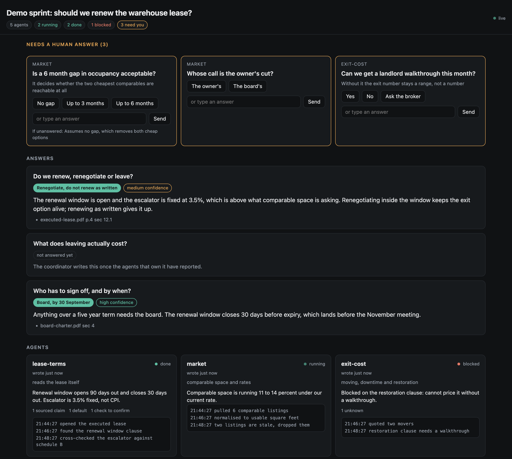
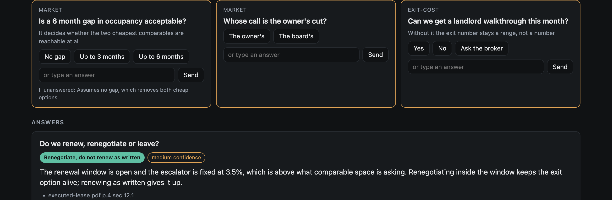
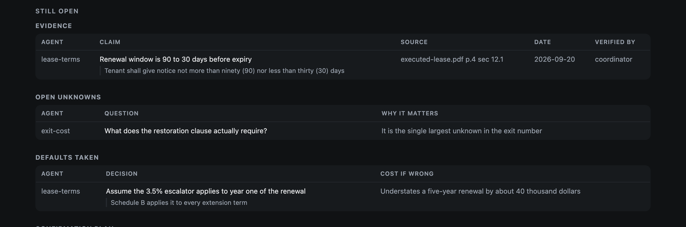

# Streaming sprint dashboard

An agent skill for running a bounded fan-out of research agents and watching
their work arrive on a live local page you can answer from. One version each for
[Claude Code](https://claude.com/claude-code), Codex CLI and grok CLI.



Six agents are going to run for twenty minutes. Two of them will hit a question
only you can settle. You should not be watching a spinner, and you should not be
interrupted six times. This page shows what each agent is doing, what it has
found, what it assumed and what it needs, and it takes your answers while the
work continues.

The agents never write HTML. They write state through one command line tool
(`sprint.py`) that owns the schema, the identifiers, the atomic writes and every
pixel of the page. That is what keeps a long run legible instead of a pile of
half-formatted output.

## Install

Download the zip from [Releases](../../releases), unzip it, then pick a host:

```bash
./install.sh claude     # ${CLAUDE_CONFIG_DIR:-~/.claude}/skills/
./install.sh codex      # ${CODEX_HOME:-~/.codex}/skills/
./install.sh grok       # ${GROK_HOME:-~/.grok}/skills/
```

Requirements: Python 3.10 or newer. Standard library only, no install step, no
network access. Nothing is deleted on install: an existing copy is moved aside.

## See it in about five seconds

```bash
python3 claude/streaming-sprint-dashboard/scripts/sprint.py demo ./sprint-demo
python3 claude/streaming-sprint-dashboard/scripts/sprint.py serve ./sprint-demo --open
```

Click an option and the answer lands in `sprint-demo/state/_feedback.jsonl`.

## What it puts on screen

**What needs you comes first**, because a panel below the fold is a panel nobody
answers. Two to four options per question, a free-text box, and what happens if
you never answer.



**Evidence is shown, not counted.** Every claim carries a source and a date, and
the page prints them rather than a tally. A default states the cost of being
wrong; an answer with no source is labelled a hypothesis, in those words.



## When not to use it

- The work is a handful of lookups. A dashboard that appears after the work is
  done is a report.
- One question, one agent.
- Nothing mid-flight needs a human decision.

The skill says this too, so the agent declines it rather than building
scaffolding nobody needed.

## The rules the tool enforces

1. **A default is a decision you would defend, with the cost of being wrong
   stated.** `add ... default` refuses one with no `--cost-if-wrong`; `check`
   rejects a one-word one.
2. **Every claim carries a source and a date.** Evidence rows require both.
3. **Agents log as they go.** An agent that writes only when it finishes leaves
   a dead card on screen, which is worse than no dashboard.

## What is in the repository

```
src/scripts/      sprint.py, schema.py, render.py, and the agent contract
src/hosts/        one SKILL.md per host, identical outside the fan-out mechanics
src/tests/        the skill's own tests, shipped with it
tests_repo/       tests for the package, including one that executes every shell
                  block in every SKILL.md with the launcher stubbed
build_dist.py     runs both suites, checks for leaked paths, writes the zip
```

Build the distributable yourself:

```bash
python3 build_dist.py --out .
```

## Tests

```bash
cd src && python3 -m unittest discover -s tests -t .     # the skill
cd .. && python3 -m unittest discover -s tests_repo -t . # the package
```

They cover the state contract, escaping, the answer round trip, path traversal
through an agent name, symlinks planted in the run directory, forty concurrent
writers, and the contrast ratios of both colour palettes, which are asserted as
numbers rather than judged by eye.

## License

MIT.
